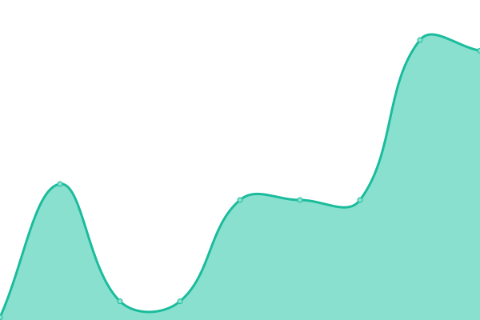
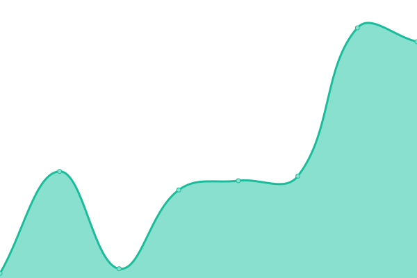

# [📈 Live Status](https://status.dgden.com): <!--live status--> **🟩 All systems operational**

This repository contains the open-source uptime monitor and status page for [Chris](https://status.dgden.com), powered by [Upptime](https://github.com/upptime/upptime).

With [Upptime](https://upptime.js.org), you can get your own unlimited and free uptime monitor and status page, powered entirely by a GitHub repository. We use [Issues](https://github.com/chrislenga/status/issues) as incident reports, [Actions](https://github.com/chrislenga/status/actions) as uptime monitors, and [Pages](https://status.dgden.com) for the status page.

<!--start: status pages-->
<!-- This summary is generated by Upptime (https://github.com/upptime/upptime) -->
<!-- Do not edit this manually, your changes will be overwritten -->
<!-- prettier-ignore -->
| URL | Status | History | Response Time | Uptime |
| --- | ------ | ------- | ------------- | ------ |
|  The Digital Den Website | 🟩 Up | [the-digital-den-website.yml](https://github.com/ChrisLenga/status/commits/HEAD/history/the-digital-den-website.yml) | 

 31ms
     
 | 

<a href="https://status.dgden.com/history/the-digital-den-website">100.00%</a>
    

|  [The Digital Den Panel](https://p.dgden.com) | 🟩 Up | [the-digital-den-panel.yml](https://github.com/ChrisLenga/status/commits/HEAD/history/the-digital-den-panel.yml) | 

 147ms
     
 | 

<a href="https://status.dgden.com/history/the-digital-den-panel">100.00%</a>
    

|  Horoscope Bot | 🟩 Up | [horoscope-bot.yml](https://github.com/ChrisLenga/status/commits/HEAD/history/horoscope-bot.yml) | 

 26ms
     
 | 

<a href="https://status.dgden.com/history/horoscope-bot">100.00%</a>
    

|  The Digital Den | 🟩 Up | [the-digital-den.yml](https://github.com/ChrisLenga/status/commits/HEAD/history/the-digital-den.yml) | 

 86ms
     
 | 

<a href="https://status.dgden.com/history/the-digital-den">100.00%</a>
    

|  GitHub Bot | 🟩 Up | [git-hub-bot.yml](https://github.com/ChrisLenga/status/commits/HEAD/history/git-hub-bot.yml) | 

 28ms
     
 | 

<a href="https://status.dgden.com/history/git-hub-bot">100.00%</a>
    

|  Streamer Bot | 🟩 Up | [streamer-bot.yml](https://github.com/ChrisLenga/status/commits/HEAD/history/streamer-bot.yml) | 

 28ms
     
 | 

<a href="https://status.dgden.com/history/streamer-bot">100.00%</a>
    

|  [FiveM] iSe.GG Combat Remastered | 🟩 Up | [five-m-i-se-gg-combat-remastered.yml](https://github.com/ChrisLenga/status/commits/HEAD/history/five-m-i-se-gg-combat-remastered.yml) | 

 15ms
     
 | 

<a href="https://status.dgden.com/history/five-m-i-se-gg-combat-remastered">100.00%</a>
    

|  [7D2D] Zed Slayers Anonymous | 🟩 Up | [7-d2-d-zed-slayers-anonymous.yml](https://github.com/ChrisLenga/status/commits/HEAD/history/7-d2-d-zed-slayers-anonymous.yml) | 

 34ms
     
 | 

<a href="https://status.dgden.com/history/7-d2-d-zed-slayers-anonymous">100.00%</a>
    

<!--end: status pages-->

[**Visit our status website →**](https://status.dgden.com)

## 📄 License

- Powered by: [Upptime](https://github.com/upptime/upptime)
- Code: [MIT](./LICENSE) © [Anand Chowdhary](https://anandchowdhary.com), supported by [Pabio](https://pabio.com)
- Data in the `./history` directory: [Open Database License](https://opendatacommons.org/licenses/odbl/1-0/)
